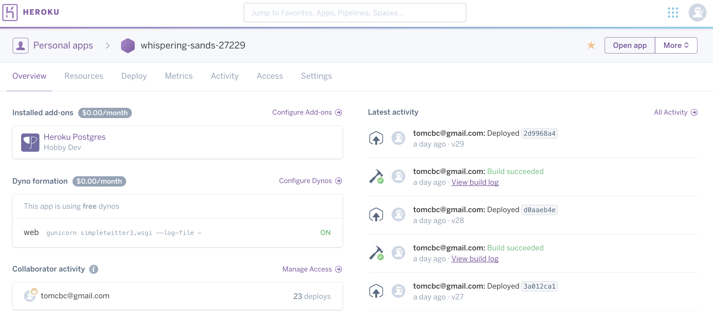
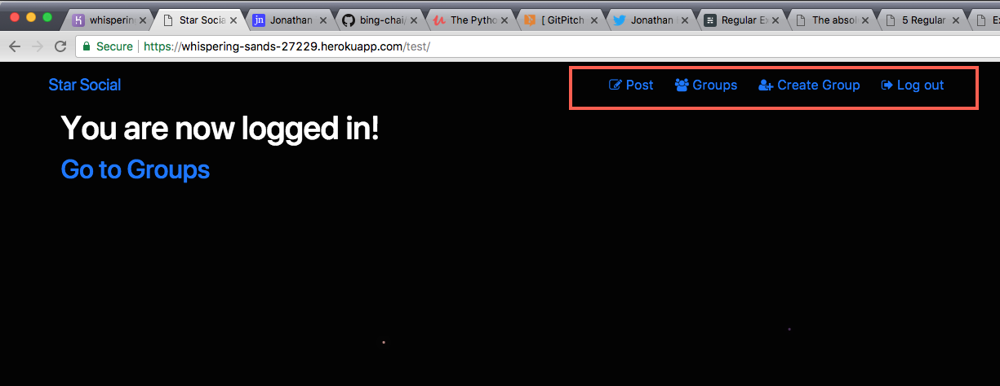

---
@title[Hello!]

# Hello, World!
## A journey with django and Python


---
@title[Introduction]

## Bing Cheng Chai
Bachelor of Food Science, PhD in Chemistry Professional Learner
---

@title[Star Social]

[Welcome to Star Social!](https://whispering-sands-27229.herokuapp.com/)
---
@title[Django Config]
```python
import os
import dj_database_url
import sys

# Build paths inside the project like this: os.path.join(BASE_DIR, ...)
BASE_DIR = os.path.dirname(os.path.dirname(os.path.abspath(__file__)))
PROJECT_ROOT = os.path.dirname(os.path.abspath(__file__))
TEMPLATE_DIR = os.path.join(BASE_DIR,'templates')
```
@[1-3](Importing packages)
@[6-8](Directory declarations)
+++
@title[package bloat]
# Package bloat?
```python
asn1crypto==0.22.0
blessed==1.14.2
botocore==1.7.32
cement==2.8.2
cffi==1.10.0
colorama==0.3.7
cryptography==1.8.1
dj-database-url==0.4.2
Django==1.11.6
django-bootstrap3==9.0.0
django-braces==1.11.0
docker-py==1.7.2
dockerpty==0.4.1
docopt==0.6.2
docutils==0.14
gunicorn==19.7.1
idna==2.5
jmespath==0.9.3
misaka==2.1.0
packaging==16.8
pathspec==0.5.0
psycopg2==2.7.3.1
pycosat==0.6.1
pycparser==2.17
pyOpenSSL==17.0.0
pyparsing==2.1.4
python-dateutil==2.6.1
pytz==2017.2
PyYAML==3.12
requests==2.9.1
semantic-version==2.5.0
six==1.10.0
tabulate==0.7.5
termcolor==1.1.0
virtualenv==15.1.0
wcwidth==0.1.7
websocket-client==0.44.0
whitenoise==3.3.1
```
+++
@title[]


---
@title[Challenges: Deployment]
# Challenges: Deployment

Amazon AWS, PythonAnywhere, Heroku
+++
@title[Heroku]
# Heroku
Migrating sqlite to postgresql
+++
@title[Deployment on Heroku]

It's alive!
---
@title[Other challenges]
## Other challenges
### Last night...

+++
@title[Internet down]
This morning...


---
@title[Adding new features]

Added glyphicons using fontawesome (previous glyphicons font support deprecated in bootstrap v4)
+++
@title[The Code]
```html
<a class="navbar-brand mynav" href="">Star Social</a>
<ul class="nav justify-content-end">
  
        <li><a href="" class="btn btn-simple"><i class="fa fa-pencil-square-o"></i> Post</a></li>
        <li><a href="" class="btn btn-simple"><i class="fa fa-users"></i> Groups</a></li>
        <li><a href="" class="btn btn-simple"><i class="fa fa-user-plus"></i> Create Group</a></li>
        <li><a href="" class="btn btn-simple"><i class="fa fa-sign-out"></i> Log out</a></li>
  
        <!-- <li><a href="" class="btn btn-simple">Groups</a></li> -->
        <li><a href="" class="btn btn-simple"><i class="fa fa-user-circle-o"></i> Sign up</a></li>
        <li><a href="" class="btn btn-simple"><i class="fa fa-sign-in"></i> Log in</a></li>
  
</ul>
```
Glyphicons
---
# Features?
- [x] glyphicons
- [ ] clean up post and group templates
- [ ] user profile pictures
- [ ] user admin features: change password, etc
---
## Thank you
### The djourney is just beginning...

---
